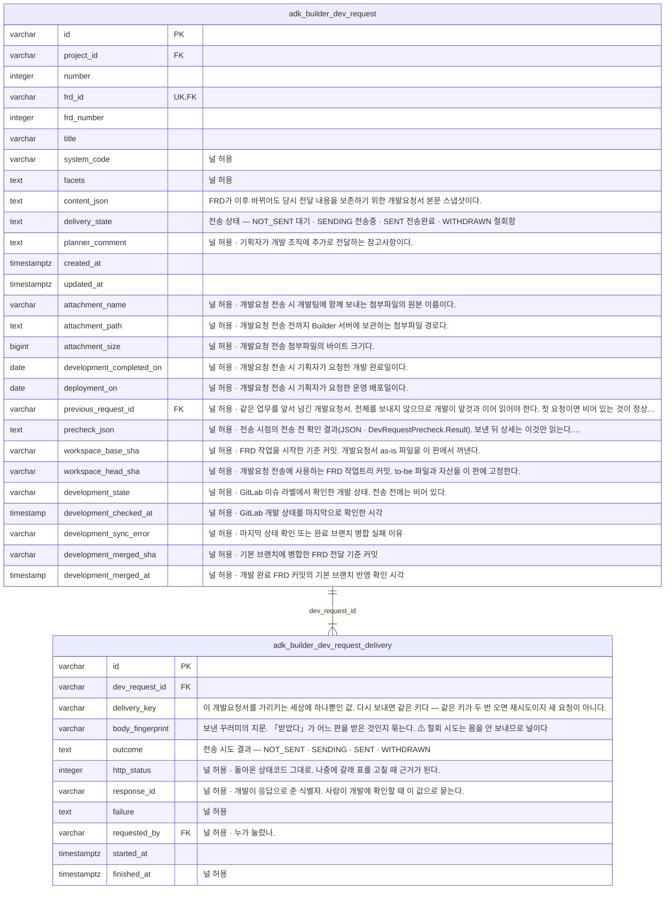
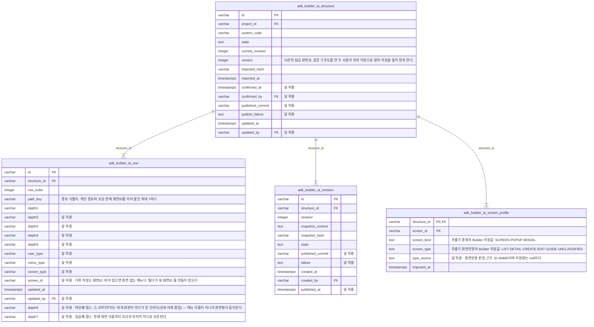
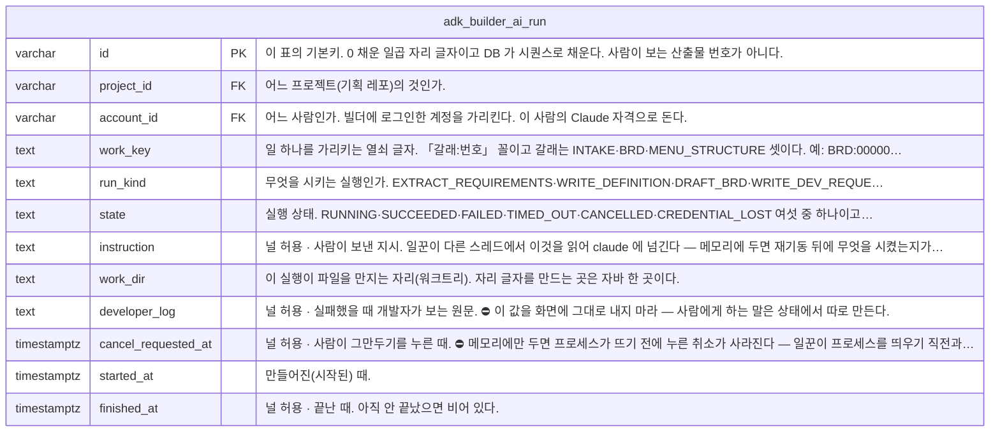
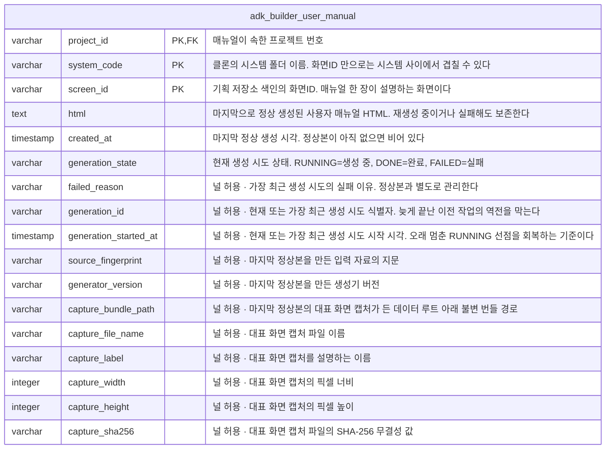
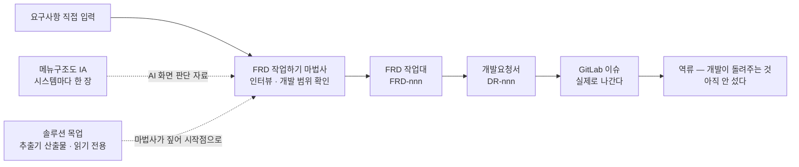

# we-adk-builder — DB 데이터 모델 (ERD)

> **2026-08-20 현재 경계.** 받은 문서·요구사항·요구사항정의서·BRD는 현재 Builder 작업 흐름에서
> 제거됐다. 아래에 남은 관련 표와 결정은 기존 데이터 호환과 설계 이력이며 새 기능의 선행 단계가 아니다.
> 현재 작업 단위와 워크트리 정본은 `docs/frd-worktree-lifecycle-design.md`다.

> **이 문서가 답하는 질문 하나: 빌더의 DB 는 무엇을 어떤 이름으로 담나.**
> *무엇을 다루나*는 [`artifacts.md`](artifacts.md) 가, *작업 단위와 워크트리가 어떻게 서나*는
> [`frd-worktree-lifecycle-design.md`](frd-worktree-lifecycle-design.md) 가 정본이다.

- 대상 DBMS: **PostgreSQL 17**(운영 목표) · Spring Boot 3.5 + **Java 17** + MyBatis + Flyway
- ⚠ **테스트는 zonky 임베디드 PostgreSQL 14.22 로 돈다.** 15+ 문법을 쓰면 **테스트에서만 깨진다**
- 스키마: **`builder`**. 같은 DB(`we_adk`)의 `public` 은 이웃 저장소 `we-adk-admin` 몫이고 **빌더는 읽지 않는다**
  (로컬 DB 정본은 `C:\WorkSpace\my-idea\.localdb\README.md`)
- 스키마는 **Flyway 단독 관리**다. ⚠ **2026-08-15 에 데이터 접근이 전부 MyBatis 로 넘어갔다** —
  JPA 와 `ddl-auto: validate` 는 사라졌다. 표 이름을 밖에서 재는 그물은 `BuilderApplicationTest` 가 맡는다
- **반영 범위: 아래 ERD 절이 실측으로 적는다.** 여기 번호를 손으로 적지 않는다 — 낡는다

---

## ⛔ DB 를 바꿨으면 이 문서를 갱신한다

**마이그레이션을 추가·수정했으면 커밋 전에 이것을 돌린다.**

```bash
python docs/tools/erd_from_migrations.py
```

ERD 절(§2)은 **손으로 적지 않는다.** 그 스크립트가 `src/main/resources/db/migration/*.sql`
전부를 버전 순서로 재생해 다시 그린다. 낡았는지만 보려면 `--check` 를 붙인다
(낡았으면 `1` 로 죽는다 — CI 에 걸 수 있다).

- **표를 새로 만들었으면** 스크립트의 `GROUPS` 에 어느 묶음인지 넣어라.
  안 넣으면 ERD 끝에 「묶음이 정해지지 않은 표」로 떨어져 눈에 띈다.
- **열의 뜻은 `COMMENT ON COLUMN` 에 적는다.** ERD 의 설명은 그것을 그대로 옮긴 것이라,
  DB 에 안 적으면 그림에도 안 나온다 (§0 의 「열은 영문 · 뜻은 한글 COMMENT」가 그 규칙이다).
- **ERD 밖의 절(§0·§3~§7)은 사람이 쓴다.** 결정과 까닭은 스크립트가 모른다 —
  DB 를 바꾼 결정이 그 절들과 어긋나면 같이 고쳐라.

⛔ **이미 적용된 마이그레이션 파일은 주석 한 글자도 고치지 마라.** Flyway 가 체크섬을 재서
`Migration checksum mismatch` 로 기동을 거절한다. 고칠 것이 있으면 새 마이그레이션을 더한다.

⛔ **번호는 파일을 만들기 직전에 `ls` 로 잰다.** 문서나 계획서에 박아 두면 갈린다 —
같은 자리를 네 번 밟았다(`V21`·`V46`·`V50`·`V52`).

```bash
ls src/main/resources/db/migration/ | sed 's/__.*//' | sort -V | tail -1
```

## 이 문서를 읽는 법 — 확정과 초안을 갈라 놨다

| 표시 | 뜻 |
|---|---|
| **확정** | 결정됐다. 코드가 이미 그렇거나, 지시로 정해졌다 |
| **초안** | **아직 아무것도 이렇게 만들지 않았다.** 출처를 함께 적어 뒀다 |
| ⚠ **미결** | 정해야 하는데 안 정한 것. **여기서 답을 지어내지 마라** |

⛔ **초안 절을 보고 「이미 반쯤 구현됐다」고 읽지 마라.** 지금 DB 에 있는 표는 셋뿐이다.

---

## 0. 이름과 채번 규칙 — 확정 (2026-08-10 · 병주 지시)

| # | 규칙 |
|---|---|
| 1 | **표 이름은 `adk_builder_` 로 시작한다** — `adk_builder_account` · `adk_builder_project` |
| 2 | **PK 는 `varchar(7)`** 이고 값은 `'0000001'` 꼴이다. **숫자형을 쓰지 않는다** |
| 3 | **PK 는 DB 가 채번한다** — 표마다 시퀀스 하나 + `DEFAULT lpad(nextval(...)::text, 7, '0')` |
| 4 | **사람이 보는 산출물 ID 는 PK 가 아니다.** 별도 열이다 (→ §4) |
| 5 | **`flyway_schema_history` 에는 프리픽스를 붙이지 않는다** — 우리가 만드는 표가 아니라 Flyway 의 장부다. 그리고 `spring.flyway.table` 을 바꾸면 Flyway 가 자기 이력을 못 찾아 **`V1` 부터 다시 돌리려 든다** |
| 6 | **열 이름은 영문 snake_case 다** — `login_id` · `default_branch`. 한글 열 이름을 쓰지 않는다 |
| 7 | **뜻은 한글 COMMENT 로 적는다** — 표마다 `comment on table`, 열마다 `comment on column`. **자세히 적는다** |

**PK 자릿수 7 은 못 늘린다.** 0 채움 정렬이 참인 것은 **폭이 고정일 때만**이다 —
폭이 섞이면 문자 비교라서 `'9' > '10'` 으로 뒤집힌다. 상한은 9,999,999 다.

### 열 이름과 주석 — 확정 (2026-08-10 · 병주 지시)

**열 이름은 영문, 주석은 한글이다.** 종전에 두 법이 섞여 있었다 —
`V1`~`V3` 은 영문 snake_case 인데 계획 2 가 그린 `ai_run` 은 한글(`갈래` · `종류` · `시작한때`)이었다.
**영문으로 통일한다.** 계획 2 의 표 넷은 어차피 §0 규칙(프리픽스 · `varchar(7)` PK) 때문에 다시 그려야 하므로
되돌릴 것은 종이 위 초안뿐이다. 아래 §1 초안 절의 한글 표기는 폐기된 것이고, 다시 그릴 때 영문으로 바뀐다.

**한글은 열 이름 자리가 아니라 COMMENT 자리로 간다.** 영문 이름이 잃는 것은 「보면 안다」인데,
그것을 COMMENT 가 도로 채운다. 그래서 **짧게 적지 않는다** — 무엇을 담는지 · 누가 채우는지 ·
값이 갈리면 갈래를 다 적는다.

```sql
comment on table  adk_builder_project              is '기획 레포 하나 = 클론 대상. 관리·프로젝트 등록이 채운다.';
comment on column adk_builder_project.state        is '클론 상태. RECEIVING(받는 중)·READY(준비됨)·FAILED(실패) 셋 중 하나를 이름 그대로 담는다. READY 인 것만 프로젝트 고르기에 뜬다.';
comment on column adk_builder_project.sealed_token is '봉인된 GitLab 접근 토큰. 평문으로 두지 않는다 — nonce 와 짝이다.';
```

⚠ **지금 `V1`~`V3` 에는 COMMENT 가 한 줄도 없다** (2026-08-10 실측 · `comment on` 0건).
**§0 소급 마이그레이션이 이름·PK 를 고칠 때 COMMENT 도 같이 붙인다** — 따로 도는 회차를 만들지 않는다.

### JPA 가 DB 채번을 못 읽어오는 문제 — 해법을 여기 박아 둔다

`@GeneratedValue(strategy = IDENTITY)` 는 **`serial`/identity 열 전용**이다.
`varchar` + `DEFAULT lpad(...)` 에는 안 먹는다. 지금 `Account`·`Project` 가 그 전략을 쓰고 있어 **소급 때 같이 바뀐다.**

**자체 식별자 생성기와 DB `DEFAULT` 를 둘 다 둔다.**

- 앱: `select nextval('adk_builder_project_seq')` → 자바에서 `%07d` 로 찍는다
- DB: 같은 시퀀스를 보는 `DEFAULT` 를 열에 남긴다

같은 시퀀스라 **충돌하지 않고**, `psql` 로 손수 넣는 자리에서도 번호가 선다.
**앞으로 만드는 표는 이 모양을 베낀다** — 표마다 다시 고민하지 않는다.

---

## 1. 표 한눈에

### 지금 있는 것 — 확정 (`V1`~`V18`)

| 표 (소급 뒤 이름) | 한글 이름 | 무엇을 담나 | 채우는 주체 |
|---|---|---|---|
| `adk_builder_account` | 계정 | 빌더에 로그인하는 사람. 슈퍼계정 포함 | 부팅 시더(슈퍼) + 관리 화면 |
| `adk_builder_claude_credential` | 클로드 자격 | 사람마다 봉인된 `claudeAiOauth` 한 칸. **자격 파일 전체가 아니다** | 「클로드 연결」 화면 |
| `adk_builder_project` | 프로젝트 | 기획 레포 하나 = 클론 대상. 봉인된 토큰과 클론 상태 | 관리 · 프로젝트 등록 |
| `adk_builder_ia_structure` | IA 정본 | 프로젝트·시스템별 상태, 현재 확정 차수, 최초 입력 해시, 게시 결과, 낙관적 잠금 판번호 | 메뉴구조도 |
| `adk_builder_ia_row` | IA 행 | `depth1`~`depth7`, 안정적인 경로 식별자, 사용자·메뉴·화면 유형, 기획 저장소 화면ID | 메뉴구조도 작업대 |
| `adk_builder_ia_revision` | IA 확정판 | 확정 때의 결정적 `ia.md` 전문·해시와 Git 게시 성공/실패 | 메뉴구조도 확정 |

### 앞으로 올 것 — 초안 (출처: `superpowers/plans/2026-08-09-plan-2-front-machinery.md`)

~~⛔ 계획 2 는 「밟지 마라」가 박힌 문서다. 그 DDL 은 §0 규칙과 어긋난다~~ →
**2026-08-10 에 닫혔다.** 계약 일곱을 닫으면서 DDL 도 §0 규칙으로 다시 그렸다.

**2026-08-10 에 다시 그려졌다.** 계획 2 의 DDL 이 §0 규칙(프리픽스 · `varchar(7)` PK + `CHECK` ·
영문 열 + 한글 COMMENT)으로 새로 서 있다. **본문은 계획 2 안에** 있고 여기는 무엇이 있는지만 적는다.
⚠ **계획 2 의 DDL 토막에는 「그 표에서만 뜻이 다른 열」의 COMMENT 만 적혀 있다** —
`id`·`project_id`·`account_id`·`created_at` 처럼 되풀이되는 열은 그 문서 Global Constraints 의
**표준 문구표**를 쓴다. **실제 SQL 에는 열마다 다 들어간다**(규칙 7).
**넷이 아니라 일곱이다** — 받은 문서, 문서 AI 처리 시도, 밀기 시도가 각자 자기 줄을 가져야 해서 셋이 늘었다.

| 표 | 무엇을 담나 | 어디 |
|---|---|---|
| `adk_builder_intake` · `adk_builder_received_document` | 접수 한 건(`process_type` 포함)과 받은 문서 원문·정리본·문서 준비 상태 | 계획 2 `V4` |
| `adk_builder_document_processing_run` | 서버 AI API를 이용한 본문 추출·정리 시도와 상태·오류·사용량 이력 | 계획 2 `V4` |
| `adk_builder_ai_run` | AI 실행 한 번의 상태(`돌고있음`·`성공`·`실패`·`시간초과`·`그만둠`·`자격끊김`) + 취소 요청 시각 | 계획 2 `V5` |
| `adk_builder_notice` | 사람마다의 알림 한 줄. 머리의 알림 자리가 이것을 읽는다 | 계획 2 `V6` |
| `adk_builder_push_job` · `adk_builder_push_history` | 밀어 달라는 부탁 한 줄과, 실제로 레포에 들어간 이력 한 줄 | 계획 2 `V7` |

⚠ **「지금 상태」와 「시도 이력」을 한 행에 담지 마라** — 두 번째 시도가 첫 번째를 지운다.
2026-08-10 에 이 함정을 두 자리에서 만났다(밀기 · 개발 전송).

### 받은 문서 종류 (2026-08-10 목업 재설계에서 확정)

- `adk_builder_received_document.document_type`은 필수다.
- 문서 종류는 문서의 업무 주제가 아니라 **받은 원문의 형태**를 구분한다. 종류는 `Flow`·`회의록`·`일반문서`다. 기존 `과업요청서`와 `제안서`는 `일반문서`로 통합한다.
- `Flow`를 고르면 게시물 ID만 입력받아 Flow API에서 가져온 게시물 제목과 본문을 원문으로 보존한다.
- 종류는 원본 문서 자체의 분류이므로 접수 상태를 가진 `adk_builder_intake`가 아니라 `adk_builder_received_document`에 둔다.
- 종류는 우선 목록 표시와 검색·필터에 사용한다. `회의록`은 선택 입력인 `meeting_at`·`attendees`를 추가로 가진다. AI가 찾지 못한 값을 임의로 채우지 않는다.
- 받은 문서 1건이 접수 1건이다. `title`과 `document_type`은 필수이고 `original_name`·`server_path`·`byte_size`는 파일이 없으면 NULL이다. 직접 입력 원문 `typed_content`도 선택이며 파일 또는 직접 입력 중 하나 이상이어야 한다.
- 파일과 직접 입력이 모두 있으면 각각 원문으로 보존한다. 사람이 보는 정본 `document_content` 와 확인 시각 `content_confirmed_at` 은 원문을 덮어쓰지 않는다.

#### 받은 문서 처리 상태와 요구사항 분석 제어 (2026-08-17 개편)

⛔ **「AI 가 모든 받은 문서를 1차 정리한다」가 폐기됐다.** 그 전제 위에 서 있던 열 셋(`process_type` ·
`preparation_state` · `normalized_content`)이 같이 없어졌다. 옛 문서에서 그 이름을 만나면 **이 절이 이긴다.**

- **축 ①  문서 내용 분석** — `adk_builder_received_document.content_state` 는 `QUEUED`·`PROCESSING`·`READY`·`FAILED` 이고
  화면에는 `내용 분석 대기`·`내용 분석 중`·`등록 완료`·`문서 처리 오류` 로 표시한다. 분석이 끝나면 별도 내용 확인 단계를 거치지 않고 바로 요구사항 분석을 시작할 수 있다.
  **걸음이 있는 것은 멀티모달 대상뿐이다** — 직접 입력과 서버가 글자를 뽑아낸 첨부는 등록하는 그 자리에서 `READY` 다.
- **축 ②  요구사항 분석 제어** — `adk_builder_intake.requirement_state` 는 `NOT_STARTED`·`RUNNING`·`REVIEW_REQUIRED`·`COMPLETED`·`FAILED` 이다.
  중복 실행 방지와 실패 후 재시도를 위한 내부 상태이며 받은 문서의 상태로 표시하지 않는다.
  ⛔ **`NOT_STARTED` 는 오류도 할 일도 아니다** — 참고 목적으로만 두는 문서가 여기 머문다. 재촉하는 색을 주지 마라.
- 받은 문서 목록은 축 ①만 `문서 상태`로 표시한다. 요구사항 쪽은 상태를 섞지 않고 이 문서에서 생성된 요구사항 건수만 표시한다.
- ⛔ **`process_type`(`UNDECIDED`·`REQUIREMENTS`·`REFERENCE`)을 되살리지 마라.** 참고 목적이면 아무것도 안 하면 된다.
- 뽑아낸 글은 `extracted_content`와 `document_content`에 함께 보존하며, **요구사항 분석에는 `document_content`가 들어간다.**
- 시도별 상태·오류·토큰/비용은 `adk_builder_document_processing_run` 에 남긴다(`EXTRACT`·`UNDERSTAND`·`ANALYZE_REQUIREMENTS`).
  재시도는 이전 시도를 덮어쓰지 않고, **같은 문서·같은 갈래에 살아 있는 시도는 하나**다(부분 유일 인덱스).

#### 문서를 대표하는 요구사항 (2026-08-15 신설, 2026-08-17 개편)

- 새 분석에서는 **받은 문서 1건당 요구사항 1건**을 만든다. 요구사항은 문서 전체의 핵심 업무 목적과 기대 결과를 대표하며, 세부 업무 요구·규칙·흐름·화면 동작으로 나누는 것은 요구사항정의서의 역할이다.
- `adk_builder_requirement` 의 출처는 `intake_id` 하나다. 개편 전 생성된 여러 요구사항은 자동 삭제하지 않으므로 DB 유일 제약은 두지 않고, 분석 서비스와 AI 출력 계약에서 1:1을 보장한다.
- 사람이 보는 번호는 `number`(숫자)이고 화면에 `REQ-001` 꼴로 적는다. **프로젝트마다 1번부터**이며
  채번은 `adk_builder_project.requirement_seq` 를 `update ... returning` 으로 집는다 — ⛔ **번호를 재사용하지 않는다.**
- 검토 상태 `review_state` 는 `DRAFTED`(생성 완료)·`CONFIRMED`(확정 완료)·`EXCLUDED`(제외)다. **제외해도 줄을 지우지 않는다.**

### 소급 — `V1`~`V3` 을 그 자리에서 다시 쓴다 (2026-08-10 병주 승인)

⛔ **소급 ALTER 회차를 만들지 않는다.** 세 파일을 **그 자리에서 새 규칙으로 다시 쓰고**
`builder` 스키마를 통째로 비운 뒤 처음부터 돌린다. 절차와 착수 전 확인 넷은 **계획 2 Task 0** 에 있다.

- **되는 까닭**: 적용된 DB 가 병주 로컬 한 채(계정 1행 · 프로젝트 0행)이고, **Flyway 장부가 그 스키마 안에 살아서**
  스키마를 버리면 체크섬 충돌이 아예 성립하지 않는다
- **ALTER 를 버린 까닭**: 기술적으로는 된다(실측으로 통과시켰다). 버린 것은 **틀려도 에러가 안 나는 실수가 둘**이라서다 —
  ① 타입만 바꾸면 **옛 `nextval` DEFAULT 가 남아** `'0000001'` 대신 `'1'` 이 들어간다(0채움 정렬이 조용히 죽는다)
  ② **표를 개명해도 시퀀스는 개명되지 않는다**
- ⚠ **유통기한** — 기획자가 브라우저로 붙거나 서버에 한 번이라도 배포되면 이 길은 죽고 **전진 전용**뿐이다

⚠ **미결 — 산출물의 상태를 담는 표가 이 목록에 없다.** 정의서 생성 요청 여부(요청 전·요청 완료) ·
BRD 의 잠금과 워크트리 배정 · 개발 전송 상태 셋이 어디 사는지 정해지지 않았다. → §3
✅ **요구사항의 상태(생성 완료·확정 완료)는 2026-08-15 에 닫혔다** — `adk_builder_requirement.review_state` 다(위 §받은 문서).

⚠ **미결 — 표 둘이 더 필요하다. 2026-08-10 에 「필요하다」까지만 정해졌다.**
① **구조도 판** — `(프로젝트, 시스템)` 마다 판번호 + 그 판의 커밋 SHA. BRD 초안이 「만든 판」·「확인한 판」으로 가리킨다
② **개발 전송** — 전송 한 건과 **시도마다 한 줄**(전송 키 · 상태코드 · 보낸 몸의 지문 · 누가 언제 어느 문을 열었나).
둘 다 **계획 4 이후**라 이번에 안 그렸다.

---

## 2. ERD — 표 전체와 그 사이의 관계

<!-- ERD:BEGIN 자동 생성 -->

> **이 절은 `docs/tools/erd_from_migrations.py` 가 만든다. 손으로 고치지 마라.**
> 정본은 `src/main/resources/db/migration/*.sql` 이고 스크립트가 그것을 재생한다.
> 다시 그리기: `python docs/tools/erd_from_migrations.py`
>
> 지금 기준 — 마이그레이션 **V74** · 표 **43개** · 열 **448개** (그중 **230개**에 한글 `COMMENT` 가 있다).
> 열 뒤의 `"..."` 는 DB 의 `COMMENT` 를 그대로 옮긴 것이다. 빈 것은 DB 에 뜻이 안 적힌 열이다.
> **PK** 기본키 · **FK** 외래키 · **UK** 유니크.
> 관계선 — `||--|{` 여럿(필수) · `||--o{` 여럿(널 허용) · `||--||` 하나(필수) · `||--o|` 하나(널 허용).

### 기반 — 사람과 프로젝트

```mermaid
erDiagram
    adk_builder_account ||--o| adk_builder_claude_credential : "account_id"
    adk_builder_project ||--|{ adk_builder_project_facet : "project_id"
    adk_builder_project ||--|{ adk_builder_project_system : "project_id"
    adk_builder_project ||--o| adk_builder_repository_update : "project_id"
    adk_builder_project ||--o| adk_builder_dev_issue_target : "project_id"
    adk_builder_account ||--o{ adk_builder_dev_issue_target : "updated_by"
    adk_builder_project ||--|{ adk_builder_design_system_curation : "project_id"
    adk_builder_account ||--o{ adk_builder_design_system_curation : "updated_by"
    adk_builder_project ||--|{ adk_builder_screen_id_group : "project_id"
    adk_builder_project ||--|{ adk_builder_screen_standard_id : "project_id"
    adk_builder_account {
        varchar id PK "이 표의 기본키. 0 채운 일곱 자리 글자이고 DB 가 시퀀스로 채운다. 사람이 보는 산출물 번호가 아니다."
        varchar login_id UK "로그인할 때 치는 ID. 이메일이 아니다. 전체에서 유일하다."
        varchar name "화면에 뜨는 표시 이름."
        varchar email "연락용 주소. 로그인에는 쓰지 않는다."
        varchar password_hash "비밀번호 해시. 평문은 담지 않는다."
        boolean super_account "참이면 관리 화면에 들어갈 수 있다. 기획자는 거짓이다."
        boolean must_change_password "참이면 다음 로그인에서 비밀번호 변경 화면으로 강제로 보낸다. 계정을 새로 만들면 참으로 난다."
        timestamptz created_at "만들어진(시작된) 때."
    }
    adk_builder_claude_credential {
        varchar account_id PK, FK "어느 사람인가. 빌더에 로그인한 계정을 가리킨다. 사람당 한 줄이라 기본키이면서 외래키다."
        bytea sealed_token "봉인된 claudeAiOauth 한 칸짜리 JSON. 평문으로 두지 않는다 — nonce 와 짝이다."
        bytea nonce "봉인 nonce. sealed_token 과 짝으로만 뜻이 있다."
        timestamptz connected_at "만들어진(시작된) 때. 여기서는 「클로드 연결」을 마친 때다."
        varchar claude_email "널 허용 · Claude Code가 로그인 상태에서 확인한 계정 이메일. 표시와 동일 계정 중복 방지에 쓴다."
        varchar claude_org_id "널 허용 · Claude Code가 확인한 조직 식별자. 실제 실행 조직을 표시하고 확인하는 데 쓴다."
        varchar claude_org_name "널 허용 · Claude Code가 확인한 조직 표시 이름."
        varchar claude_subscription_type "널 허용 · Claude Code가 확인한 구독 종류."
    }
    adk_builder_project {
        varchar id PK "이 표의 기본키. 0 채운 일곱 자리 글자이고 DB 가 시퀀스로 채운다. 사람이 보는 산출물 번호가 아니다. 주소와 워크트리 폴더 이름이…"
        varchar name UK "프로젝트 이름. 앞뒤 빈 칸은 다듬어 저장하고 빈 이름은 거절한다. 전체에서 유일하다."
        varchar repo_url "기획 레포(GitLab) 주소. 클론이 이 주소를 쓴다."
        varchar default_branch "클론한 뒤 체크아웃할 기본 브랜치 이름."
        bytea sealed_token "봉인된 GitLab 접근 토큰. 평문으로 두지 않는다 — token_nonce 와 짝이다."
        bytea token_nonce "봉인 nonce. sealed_token 과 짝으로만 뜻이 있다."
        varchar state "클론 상태. RECEIVING(받는 중)·READY(준비됨)·FAILED(실패) 셋 중 하나를 이름 그대로 담는다. READY 인 것만 프…"
        text failure_reason "널 허용 · 클론이 실패한 까닭. FAILED 일 때만 차고, 다시 받거나 성공하면 비운다."
        timestamptz created_at "만들어진(시작된) 때. 여기서는 프로젝트를 등록한 때다."
        integer requirement_seq "이 프로젝트가 지금까지 채번한 요구사항 순번의 마지막 값. ⛔ 요구사항을 지우거나 제외해도 이 값은 안 줄어든다 — 번호 재사용 금지가 여…"
        integer frd_seq "이 프로젝트가 지금까지 채번한 FRD 순번의 마지막 값. ⛔ FRD 를 지워도 줄지 않는다 — 번호 재사용 금지가 여기 걸려 있다. 채번은…"
        varchar platform_code "표준 화면ID 의 첫 마디(PS 꼴). 등록할 때 사람이 정하고 그 뒤로 안 바뀐다 — 클론이 앉으면 바로 채번이 도는데, 이미 박힌 표준…"
        integer dev_request_seq "프로젝트 안에서 사람이 보는 DR 번호를 중복 없이 채번하기 위한 마지막 번호다."
    }
    adk_builder_project_facet {
        varchar project_id PK, FK "어느 프로젝트의 적용 구분인가."
        varchar name PK "기획자가 화면에서 보는 적용 구분 이름. 코드는 유지한 채 이름만 바꿀 수 있다."
        varchar code "널 허용 · 추출기 색인과 연결하는 고정 식별자. jeju·iksan처럼 파일과 API에서 쓰며 표시 이름과 분리한다."
    }
    adk_builder_project_system {
        varchar project_id PK, FK "어느 프로젝트인가. 프로젝트 하나 = 기획 레포 하나다."
        varchar system_code PK "manifest.json 의 systems[].id 그대로다(backoffice·webview·online-pg·saleoffice·lsp…"
        varchar display_name "널 허용 · 화면에 뜨는 한글 이름(백오피스 꼴). ⚠ 비어 있는 것이 정상이다 — 그러면 화면이 system_code 를 그대로 낸다.…"
    }
    adk_builder_repository_update {
        varchar project_id PK, FK
        varchar state
        varchar from_commit "널 허용 · 업데이트 직전 HEAD."
        varchar current_commit "널 허용 · 업데이트가 끝난 뒤 HEAD."
        boolean changed "널 허용 · 원격 변경이 실제로 반영됐는가."
        timestamptz started_at
        timestamptz finished_at "널 허용"
        varchar failure_reason "널 허용 · 실패 이유. 토큰이 섞인 주소는 저장 전에 가린다."
    }
    adk_builder_dev_issue_target {
        varchar project_id PK, FK
        text base_url "GitLab 주소. 예: https://gitlab.example.com — /api/v4 는 코드가 붙인다."
        text project_path "이슈를 여는 저장소. 네임스페이스를 포함한 경로이거나 숫자 ID다. ⛔ 기획 저장소가 아니라 개발 조직의 트래커다."
        bytea token_cipher "봉인한 GitLab 토큰. ⛔ 평문으로 두지 않는다 — 클론 토큰과 갈라 둔다(이슈 생성 권한이 따로 필요하다)."
        bytea token_nonce
        timestamptz updated_at
        varchar updated_by FK "널 허용"
    }
    adk_builder_design_system_curation {
        varchar project_id PK, FK
        varchar system_id PK
        text content_json "원본 HTML이나 CSS가 아니라 사람이 확정한 컴포넌트 큐레이션 값만 담는다."
        integer version "동시에 편집할 때 뒤의 저장이 앞의 확정값을 조용히 덮지 않도록 확인하는 버전."
        timestamptz updated_at
        varchar updated_by FK "널 허용"
    }
    adk_builder_screen_id_group {
        varchar id PK
        varchar project_id FK
        varchar system_code
        varchar area_key "IA 경로의 첫 마디 slug(merchant). 안정적인 경로 식별자라 이것이 열쇠다."
        varchar area_code "AI 가 1회 지은 대문자 3글자(MRC). 못 지었으면 XXX 다. 사람이 고쳐도 이미 박힌 표준 ID 는 안 바뀐다."
        varchar area_label "널 허용"
        varchar group_key "IA 경로의 둘째 마디 slug. 마디가 하나뿐인 가지는 빈 문자열이다."
        integer group_no "기능그룹 3자리 번호. group_key 가 비면 0 이다."
        varchar group_label "널 허용"
        timestamptz created_at
    }
    adk_builder_screen_standard_id {
        varchar id PK
        varchar project_id FK
        varchar screen_id "기획 레포의 화면ID(bo-usag-list 꼴). 이것이 열쇠다."
        varchar standard_id "상태 마디를 뺀 5마디(PS-BO-MRC-010-L01). ⛔ 상태 마디(S·N·C)는 저장하지 않는다 — 볼 때 조립한다."
        text origin "S(클론 색인에서 왔다)·N(빌더에서 새로 났다). 화면 속성이라 불변이다."
        integer sort_no "정렬용 순번. ⛔ standard_id 문자열로 정렬하지 마라 — 일련번호가 3자리로 늘면 뒤집힌다."
        timestamptz created_at
    }
```



⚠ **뜻이 DB 에 안 적힌 열** — `COMMENT ON COLUMN` 이 없어 위 그림에도 설명이 없다. §0 규칙(「열은 영문 · 뜻은 한글 COMMENT」)을 못 지킨 자리다.

- `adk_builder_repository_update` — 4개: `project_id`, `state`, `started_at`, `finished_at`
- `adk_builder_dev_issue_target` — 4개: `project_id`, `token_nonce`, `updated_at`, `updated_by`
- `adk_builder_design_system_curation` — 4개: `project_id`, `system_id`, `updated_at`, `updated_by`
- `adk_builder_screen_id_group` — 6개: `id`, `project_id`, `system_code`, `area_label`, `group_label`, `created_at`
- `adk_builder_screen_standard_id` — 3개: `id`, `project_id`, `created_at`

### FRD — 작업 단위

```mermaid
erDiagram
    adk_builder_frd ||--|{ adk_builder_frd_item : "frd_id"
    adk_builder_frd ||--|{ adk_builder_frd_facet : "frd_id"
    adk_builder_frd ||--|{ adk_builder_frd_analysis_note : "frd_id"
    adk_builder_frd ||--|{ adk_builder_frd_backend_change : "frd_id"
    adk_builder_frd ||--|{ adk_builder_frd_interview_message : "frd_id"
    adk_builder_frd {
        varchar id PK
        varchar project_id FK
        integer number "사람이 보는 순번. 화면에는 FRD-001 꼴로 적는다. ⛔ 문자열이 아니라 숫자다 — 문자열로 정렬하면 FRD-10 이 FRD-9 앞에…"
        varchar title
        varchar system_code "널 허용"
        text source_kind "요구사항이 어디서 왔나. PASTED(붙여넣기)·REQUIREMENT(요구사항에서 가져옴)·BRD(BRD 에서 가져옴)."
        varchar source_ref "널 허용 · 가져온 원본의 이름. REQ-012·BRD-003 같은 글자다. ⛔ 외래키가 아니다 — 사슬 넷이 나중에 별도 시스템으로 나갈…"
        text source_text "요구사항 원문 사본. ⭐ 가져온 경우에도 그때 베껴 담는다 — 원본이 나중에 바뀌어도 이 FRD 는 안 흔들린다."
        timestamptz source_imported_at "널 허용"
        text no_screen_reason "널 허용 · AI 가 「화면 일이 아니다」라고 본 까닭. 화면이 있으면 비어 있다."
        text state "ANALYZING 요구사항 분석 중, WAITING_ANSWER 답변 필요, ANALYSIS_FAILED 분석 오류, PICKED 분석 결…"
        text failure "널 허용 · 분석이 실패한 까닭 요약. 화면에 「분석 오류」로만 뜨므로 왜인지를 아는 자리가 여기다."
        varchar owner_account_id FK "널 허용"
        timestamptz created_at
        timestamptz updated_at
        timestamptz completed_at "널 허용 · FRD 작업을 완료해 개발요청서 검토(REVIEW)로 전환된 최초 시각. 최종 반영(DONE)까지 유지한다."
    }
    adk_builder_frd_item {
        varchar id PK
        varchar frd_id FK
        integer seq "요구사항 원문에서의 차례. ⚠ 사람이 원문과 나란히 읽는 순서라 화면도 이 순서로 낸다."
        text requirement "요구사항 항목 원문. ⭐ AI 가 고쳐 쓴 요약이 아니라 원문 그대로여야 사람이 대조할 수 있다."
        text verdict "SCREEN(고칠 화면을 찾았다)·NO_SCREEN(화면 일이 아니다 — domains/ 에 근거가 있다)·NOT_INDEXED(화면 일인…"
        text screen_ids "널 허용 · 이 항목이 가리키는 화면ID 를 쉼표로 이은 것. ⚠ 사람이 읽는 근거일 뿐이다 — 작업 단위는 adk_builder_frd_…"
        text note "널 허용 · AI 가 그렇게 본 까닭 한 문장. NO_SCREEN 이면 domains/ 의 근거가, NOT_INDEXED 면 찾던 화면ID…"
        timestamptz created_at
        text nature "DEVELOP(그 일을 할 기능이 없다 — 만들거나 고친다: 화면·로직·배치·API)·OPERATE(기능이 이미 있다 — 운영자가 자료·콘…"
    }
    adk_builder_frd_facet {
        varchar frd_id PK, FK "접수처를 적용할 FRD."
        varchar project_id "프로젝트 접수처 목록과 복합 외래키를 걸기 위한 프로젝트ID."
        varchar name PK "프로젝트에 등록된 접수처 이름."
    }
    adk_builder_frd_analysis_note {
        varchar id PK
        varchar frd_id FK
        integer seq
        text kind "완료 기준, 확인 필요 항목 또는 AI가 권장한 작업 진행 방식이다."
        text content
        timestamptz created_at
    }
    adk_builder_frd_backend_change {
        varchar id PK
        varchar frd_id FK
        integer seq
        integer requirement_seq "널 허용 · adk_builder_frd_item.seq와 연결되는 요구사항 차례. 근거를 특정 항목에 연결하지 못했으면 비어 있다."
        text category
        varchar target
        text change_detail
        text evidence "널 허용"
        boolean required "true면 수정 필요, false면 조사했지만 변경 없음이다."
        timestamptz created_at
        text verification "널 허용 · 이 백엔드 변경을 무엇으로 됐다고 판정하나. 화면은 목업이 그 노릇을 하지만 화면 외 구현은 이 칸이 없으면 항목별 검수가 갈…"
    }
    adk_builder_frd_interview_message {
        varchar id PK
        varchar frd_id FK
        integer seq
        text role
        text kind
        text content
        varchar question_topic "널 허용"
        text question_reason "널 허용"
        text options_json "널 허용 · 질문 선택지의 JSON 문자열 배열. 직접 입력은 모든 질문에 공통으로 화면이 덧붙이므로 저장하지 않는다."
        timestamptz created_at
    }
```



⚠ **뜻이 DB 에 안 적힌 열** — `COMMENT ON COLUMN` 이 없어 위 그림에도 설명이 없다. §0 규칙(「열은 영문 · 뜻은 한글 COMMENT」)을 못 지킨 자리다.

- `adk_builder_frd` — 8개: `id`, `project_id`, `title`, `system_code`, `source_imported_at`, `owner_account_id`, `created_at`, `updated_at`
- `adk_builder_frd_item` — 3개: `id`, `frd_id`, `created_at`
- `adk_builder_frd_analysis_note` — 5개: `id`, `frd_id`, `seq`, `content`, `created_at`
- `adk_builder_frd_backend_change` — 8개: `id`, `frd_id`, `seq`, `category`, `target`, `change_detail`, `evidence`, `created_at`
- `adk_builder_frd_interview_message` — 9개: `id`, `frd_id`, `seq`, `role`, `kind`, `content`, `question_topic`, `question_reason`, `created_at`

이 묶음에서 밖으로 나가는 외래키:

- `adk_builder_frd.project_id` → `adk_builder_project`
- `adk_builder_frd.owner_account_id` → `adk_builder_account`
- `adk_builder_frd_facet.project_id, name` → `adk_builder_project_facet`

### FRD 화면 작업

```mermaid
erDiagram
    adk_builder_frd_screen ||--|{ adk_builder_frd_screen_history : "frd_screen_id"
    adk_builder_frd_screen ||--o| adk_builder_frd_screen_ia_placement : "frd_screen_id"
    adk_builder_frd_screen ||--|{ adk_builder_frd_screen_chat_message : "frd_screen_id"
    adk_builder_frd_screen ||--|{ adk_builder_frd_screen_marker : "frd_screen_id"
    adk_builder_frd_screen_history ||--|{ adk_builder_frd_screen_marker_history : "screen_history_id"
    adk_builder_frd_screen ||--|{ adk_builder_frd_screen_memo_comment : "frd_screen_id"
    adk_builder_frd_screen {
        varchar id PK
        varchar frd_id FK
        varchar screen_id "기획 저장소의 화면ID(wv-appr-write 꼴). ⛔ 빌더가 이름을 지어내지 않는다 — 새 화면이면 사람이 적는다."
        varchar screen_name "널 허용"
        varchar base_screen_id "널 허용 · 무엇을 베껴 시작했나. 기존 화면이면 screen_id 와 같고 새 화면이면 다르다."
        varchar facet "널 허용"
        text pick_reason "널 허용"
        text state
        text html "널 허용 · AI 가 만든 to-be 화면 통째. ⚠ DB 에 사는 것은 이번 판 한정이다 — 기획 저장소로 밀 자리가 아직 없다(계획 2…"
        text changes "널 허용 · AI 가 무엇을 왜 고쳤나 목록(JSON 배열 글자). ⭐ 사람이 html 을 훑지 않고 아는 유일한 길이고 다음 판의 개발요…"
        text failure "널 허용"
        timestamptz generated_at "널 허용"
        timestamptz created_at
        varchar system_code "널 허용 · 이 화면이 사는 시스템(webview·backoffice·online-pg). ⛔ FRD 하나가 한 시스템이라고 보지 마라 —…"
        text memo "널 허용 · V32 단일 메모 호환 열. 댓글형 메모는 adk_builder_frd_screen_memo_comment에 저장하며 새 코드…"
        varchar screen_type "널 허용 · 신규 화면의 유형 — 목록·상세·등록·수정·안내. 사람이 「화면 추가」에서 고른다. ⚠ 기존 화면은 비어 있다(색인이 안다).…"
        text scope_change "널 허용 · 요구사항 때문에 이 화면에 필요한 신규·수정 내용. 분석 결과와 개발 범위 확인에서 화면별로 표시하며 선택 출처인 pick_r…"
        timestamptz excluded_at "널 허용 · 전체 캔버스나 개발 범위 확인에서 작업 대상에서 제외한 시각. 원본 화면·대화·변경 이력은 삭제하지 않는다."
    }
    adk_builder_frd_screen_history {
        bigint id PK
        varchar frd_screen_id FK
        text html
        text changes "널 허용 · 이 버전에서 AI가 수정했다고 보고한 내용. 화면 표시를 위해 줄바꿈으로 구분한다."
        timestamptz created_at
        text md "널 허용 · 화면 HTML과 같은 시점의 화면 정의 MD. 캔버스에서 이동 관계를 바꾼 이력과 복원에 사용한다."
        varchar operation_id "널 허용 · 맵 AI 요청 하나가 여러 화면을 바꿨을 때 그 이력을 함께 묶는 실행 ID."
        varchar source "화면별 작업대 또는 FRD 캔버스 AI 중 이 변경이 시작된 작업 공간."
        varchar tobe_document_state "변경 예정 기능정의서 생성 상태: NOT_REQUESTED, REQUESTED, RUNNING, SUCCEEDED, FAILED, UNKN…"
        varchar tobe_document_failure "널 허용 · 생성 실패 이유 코드. 사용자 화면에는 코드별 한국어 안내를 표시한다."
        timestamptz tobe_document_updated_at "널 허용 · 기능정의서 생성 상태가 마지막으로 바뀐 시각"
    }
    adk_builder_frd_screen_ia_placement {
        varchar frd_screen_id PK, FK
        varchar placement_mode "MENU=메뉴 직접 배치, CHILD=화면형 상위화면, OPENER=팝업·모달 여는 화면, UNRESOLVED=위치 미정."
        varchar structure_id "널 허용"
        text menu_path_key "널 허용"
        varchar anchor_screen_id "널 허용"
        varchar screen_kind
        varchar status
        varchar source
        varchar development_file_name "널 허용 · 개발 조직이 신규 화면 파일을 만들 때 사용할 최종 파일명. tmp 화면ID와 별개다."
        timestamptz updated_at
        varchar updated_by "널 허용"
    }
    adk_builder_frd_screen_chat_message {
        varchar id PK
        varchar frd_id UK, FK
        varchar frd_screen_id FK
        integer sequence_no "한 화면의 대화 표시 순서. 사용자 요청과 그 요청의 AI 응답이 연속 번호를 갖는다."
        varchar role
        varchar state
        text content "널 허용"
        text failure "널 허용"
        timestamptz created_at
        timestamptz completed_at "널 허용"
        varchar session_id "널 허용 · 이 응답을 만든 Claude 세션 ID. 다음 화면 대화에서 같은 세션을 이어갈 때 사용한다."
        varchar channel "화면 상세 대화(SCREEN)와 전체 캔버스 대화(CANVAS)를 구분한다."
    }
    adk_builder_frd_screen_marker {
        varchar id PK
        varchar frd_screen_id FK
        integer marker_no "화면 안에서 사용자가 보는 마커 번호."
        varchar author_account_id FK "실행 마커를 처음 작성한 Builder 계정."
        varchar author_name "작성 당시 표시 이름."
        varchar selector "마커를 연결한 DOM 요소의 CSS 선택자."
        varchar element_label "마커를 연결할 당시 화면 요소를 설명하는 문구."
        double relative_x "연결 요소 너비에 대한 마커 가로 위치 비율."
        double relative_y "연결 요소 높이에 대한 마커 세로 위치 비율."
        double document_x "요소를 찾지 못할 때 사용할 문서 너비 기준 가로 비율."
        double document_y "요소를 찾지 못할 때 사용할 문서 높이 기준 세로 비율."
        text description "사용자가 기록한 실행 마커 설명. 4,000자 이내다."
        timestamptz created_at "실행 마커를 처음 작성한 때."
        timestamptz updated_at "실행 마커 설명을 마지막으로 수정한 때."
    }
    adk_builder_frd_screen_marker_history {
        bigint id PK
        bigint screen_history_id FK
        varchar marker_id
        integer marker_no
        varchar author_account_id
        varchar author_name
        varchar selector
        varchar element_label
        double relative_x
        double relative_y
        double document_x
        double document_y
        varchar description
        timestamptz created_at
        timestamptz updated_at
    }
    adk_builder_frd_screen_memo_comment {
        varchar id PK
        varchar frd_screen_id FK
        varchar author_account_id FK "메모를 작성한 Builder 계정."
        varchar author_name "작성 당시 표시 이름. 계정 이름이 바뀌어도 과거 메모 표기를 유지한다."
        text content "사용자가 작성한 메모 내용. 10,000자 이내다."
        timestamptz created_at "메모를 작성한 때."
    }
```



⚠ **뜻이 DB 에 안 적힌 열** — `COMMENT ON COLUMN` 이 없어 위 그림에도 설명이 없다. §0 규칙(「열은 영문 · 뜻은 한글 COMMENT」)을 못 지킨 자리다.

- `adk_builder_frd_screen` — 9개: `id`, `frd_id`, `screen_name`, `facet`, `pick_reason`, `state`, `failure`, `generated_at`, `created_at`
- `adk_builder_frd_screen_history` — 4개: `id`, `frd_screen_id`, `html`, `created_at`
- `adk_builder_frd_screen_ia_placement` — 9개: `frd_screen_id`, `structure_id`, `menu_path_key`, `anchor_screen_id`, `screen_kind`, `status`, `source`, `updated_at`, `updated_by`
- `adk_builder_frd_screen_chat_message` — 9개: `id`, `frd_id`, `frd_screen_id`, `role`, `state`, `content`, `failure`, `created_at`, `completed_at`
- `adk_builder_frd_screen_marker` — 2개: `id`, `frd_screen_id`
- `adk_builder_frd_screen_marker_history` — 15개: `id`, `screen_history_id`, `marker_id`, `marker_no`, `author_account_id`, `author_name`, `selector`, `element_label`, `relative_x`, `relative_y`, `document_x`, `document_y`, `description`, `created_at`, `updated_at`
- `adk_builder_frd_screen_memo_comment` — 2개: `id`, `frd_screen_id`

이 묶음에서 밖으로 나가는 외래키:

- `adk_builder_frd_screen.frd_id` → `adk_builder_frd`
- `adk_builder_frd_screen_chat_message.frd_id` → `adk_builder_frd`
- `adk_builder_frd_screen_marker.author_account_id` → `adk_builder_account`
- `adk_builder_frd_screen_memo_comment.author_account_id` → `adk_builder_account`

### 개발요청서와 전송



⚠ **뜻이 DB 에 안 적힌 열** — `COMMENT ON COLUMN` 이 없어 위 그림에도 설명이 없다. §0 규칙(「열은 영문 · 뜻은 한글 COMMENT」)을 못 지킨 자리다.

- `adk_builder_dev_request` — 10개: `id`, `project_id`, `number`, `frd_id`, `frd_number`, `title`, `system_code`, `facets`, `created_at`, `updated_at`
- `adk_builder_dev_request_delivery` — 5개: `id`, `dev_request_id`, `failure`, `started_at`, `finished_at`

이 묶음에서 밖으로 나가는 외래키:

- `adk_builder_dev_request.project_id` → `adk_builder_project`
- `adk_builder_dev_request.frd_id` → `adk_builder_frd`
- `adk_builder_dev_request_delivery.requested_by` → `adk_builder_account`

### 메뉴구조도 (IA)



⚠ **뜻이 DB 에 안 적힌 열** — `COMMENT ON COLUMN` 이 없어 위 그림에도 설명이 없다. §0 규칙(「열은 영문 · 뜻은 한글 COMMENT」)을 못 지킨 자리다.

- `adk_builder_ia_structure` — 13개: `id`, `project_id`, `system_code`, `state`, `current_revision`, `imported_hash`, `imported_at`, `confirmed_at`, `confirmed_by`, `published_commit`, `publish_failure`, `updated_at`, `updated_by`
- `adk_builder_ia_row` — 13개: `id`, `structure_id`, `row_order`, `depth1`, `depth2`, `depth3`, `depth4`, `depth5`, `user_type`, `menu_type`, `screen_type`, `updated_at`, `updated_by`
- `adk_builder_ia_revision` — 11개: `id`, `structure_id`, `revision`, `snapshot_content`, `snapshot_hash`, `state`, `published_commit`, `failure`, `created_at`, `created_by`, `published_at`
- `adk_builder_ia_screen_profile` — 3개: `structure_id`, `screen_id`, `imported_at`

이 묶음에서 밖으로 나가는 외래키:

- `adk_builder_ia_revision.created_by` → `adk_builder_account`
- `adk_builder_ia_row.updated_by` → `adk_builder_account`
- `adk_builder_ia_structure.project_id` → `adk_builder_project`
- `adk_builder_ia_structure.confirmed_by` → `adk_builder_account`
- `adk_builder_ia_structure.updated_by` → `adk_builder_account`

### AI 실행



이 묶음에서 밖으로 나가는 외래키:

- `adk_builder_ai_run.project_id` → `adk_builder_project`
- `adk_builder_ai_run.account_id` → `adk_builder_account`

### 그린존 — 빌더가 만드는 산출물



이 묶음에서 밖으로 나가는 외래키:

- `adk_builder_user_manual.project_id` → `adk_builder_project`

### ⛔ 폐기된 앞단 — 표만 남아 있다

```mermaid
erDiagram
    adk_builder_intake ||--|{ adk_builder_intake_facet : "intake_id"
    adk_builder_intake ||--|{ adk_builder_received_document : "intake_id"
    adk_builder_received_document ||--|{ adk_builder_document_processing_run : "document_id"
    adk_builder_intake ||--|{ adk_builder_requirement : "intake_id"
    adk_builder_intake {
        varchar id PK "이 표의 기본키. 0 채운 일곱 자리 글자이고 DB 가 시퀀스로 채운다. 사람이 보는 산출물 번호가 아니다."
        varchar project_id FK "어느 프로젝트의 접수인가. 프로젝트 하나 = 기획 레포 하나다."
        varchar title "이 접수를 사람이 알아보는 이름. 등록 화면의 「문서명」이 그대로 온다."
        varchar uploaded_by FK "올린 사람. 빌더에 로그인한 계정을 가리킨다."
        timestamptz uploaded_at "만들어진(시작된) 때. 여기서는 문서를 등록한 때다."
        smallint step "지금 몇 번째 칸인가(1~8). 이 회차는 칸 1(받은 문서)만 세운다 — 칸 2~8 은 계획 3 이다. 화면의 「현재 단계」 열은 이 값…"
        text requirement_state "이 받은 문서에서 요구사항을 뽑는 일의 지금 상태. NOT_STARTED(미분석)·RUNNING(요구사항 분석 중)·REVIEW_REQUI…"
    }
    adk_builder_intake_facet {
        varchar intake_id PK, FK "어느 접수인가."
        varchar project_id "어느 프로젝트인가. ⛔ 중복이 아니라 (project_id, name) 을 통째로 프로젝트 적용 구분 목록에 FK 로 걸기 위한 열이다."
        varchar name PK "고른 적용 구분 이름. 그 프로젝트의 목록에 있는 값만 들어온다."
    }
    adk_builder_received_document {
        varchar id PK "이 표의 기본키. 0 채운 일곱 자리 글자이고 DB 가 시퀀스로 채운다."
        varchar intake_id UK, FK "어느 접수에 딸린 문서인가. 지금은 접수 하나에 문서 하나다."
        text document_type "받은 원문의 형태. FLOW(Flow)·MEETING_MINUTES(회의록)·OTHER(일반문서) 중 하나다."
        varchar original_name "널 허용 · 선택 첨부파일의 원래 이름. 파일이 없으면 NULL 이다. ⛔ 이 값을 경로에 그대로 쓰지 마라 — 경로 구분자와 상위 이동…"
        text server_path "널 허용 · 서버 디스크에 실제로 앉은 자리. 글자를 만드는 곳은 ProjectPaths 하나뿐이다. 파일이 없으면 NULL 이다."
        bigint byte_size "널 허용 · 파일 크기(바이트). 목록에 보여주고 올릴 때 상한을 재는 데 쓴다. 파일이 없으면 NULL 이다."
        text typed_content "널 허용 · 사람이 직접 입력한 원문. 파일과 함께 있으면 AI 정리의 보충 설명이며, 어느 쪽이든 원문으로 그대로 보존한다."
        timestamptz meeting_at "널 허용 · 회의 일시. 문서 종류가 회의록일 때만 쓰는 선택 입력이다. AI 가 찾지 못한 값을 임의로 채우지 않는다."
        text attendees "널 허용 · 참석자. 문서 종류가 회의록일 때만 쓰는 선택 입력이다. AI 가 찾지 못한 값을 임의로 채우지 않는다."
        text read_check_reason "널 허용 · 올린 파일에서 글자가 나오는지 잰 결과의 한 줄 설명(DocumentReadCheck). 못 읽는 문서도 원본은 보존하고 올리…"
        text extracted_content "널 허용 · 서버나 멀티모달 AI 가 파일에서 뽑아낸 글. 평문은 그대로 읽고 PDF 는 pdftotext 이며, 그것으로 글자가 안 나오…"
        text content_state "널 허용 · 첨부파일 내용 분석 상태. QUEUED(내용 분석 대기)·PROCESSING(내용 분석 중)·READY(등록 완료)·FAILE…"
        text document_content "널 허용 · 확인된 문서 내용. 직접 입력이면 사람이 친 원문 그대로, 서버 텍스트 추출이면 뽑은 글, 멀티모달이면 사람이 확인·수정한 글…"
        timestamptz content_confirmed_at "널 허용 · 멀티모달 추출 결과를 사람이 확인해 마친 때. ⚠ 직접 입력과 서버 텍스트 추출은 확인할 것이 없어 NULL 로 남는다 — 이…"
    }
    adk_builder_document_processing_run {
        varchar id PK "이 표의 기본키. 0 채운 일곱 자리 글자이고 DB 가 시퀀스로 채운다."
        varchar document_id FK "어느 받은 문서를 처리한 시도인가."
        text run_kind "무엇을 한 시도인가. EXTRACT(파일에서 본문 뽑기 — 서버가 한다. 평문은 그대로 읽고 PDF 는 pdftotext 다. AI 가 아…"
        text state "이 시도의 끝. WAITING(줄 섬)·RUNNING(도는 중)·SUCCEEDED(성공)·FAILED(실패) 중 하나다."
        text provider_run_id "널 허용 · claude 가 돌려준 세션 식별자. 저쪽 로그와 맞춰 보는 데 쓴다. 못 받으면 NULL 이다 — 판정에 쓰지 마라."
        text error_message "널 허용 · 실패한 까닭. FAILED 일 때만 찬다."
        bigint input_tokens "널 허용 · 이 시도가 쓴 입력 토큰 수."
        bigint output_tokens "널 허용 · 이 시도가 쓴 출력 토큰 수."
        numeric cost_amount "널 허용 · 이 시도의 비용. 통화는 운영에서 하나로 고정한다."
        timestamptz started_at "널 허용 · 실제로 돌기 시작한 때. 줄만 서고 아직 안 돌았으면 NULL 이다."
        timestamptz finished_at "널 허용 · 끝난 때. 성공이든 실패든 찬다."
        timestamptz created_at "만들어진(시작된) 때. 여기서는 이 시도를 줄에 세운 때다."
    }
    adk_builder_requirement {
        varchar id PK "이 표의 기본키. 0 채운 일곱 자리 글자이고 DB 가 시퀀스로 채운다. ⛔ 사람이 보는 REQ 번호가 아니다 — 그것은 number 다."
        varchar project_id FK "어느 프로젝트의 요구사항인가. 번호가 프로젝트마다 1번부터라 채번의 단위이기도 하다."
        varchar intake_id FK "출처가 되는 받은 문서. 새 분석에서는 받은 문서 한 건과 요구사항 한 건이 대응한다."
        integer number "사람이 보는 순번. 화면에는 REQ-001 꼴로 적는다. ⛔ 문자열이 아니라 숫자다 — 문자열로 정렬하면 REQ-10 이 REQ-9 보다…"
        varchar title "요구사항 한 줄 이름. AI 초안이 그대로 앉고 사람이 고칠 수 있다."
        text body "요구사항 본문. ⛔ AI 가 추측해 지어낸 것은 안 담는다 — 받은 문서에 있는 요구만 담는다."
        text screen_hints "널 허용 · AI 가 기획 저장소에서 찾은 관련 화면 후보. ⚠ BRD 의 최종 대상 화면과 다른 값이다 — 참고 정보라서 관계 표로 만들…"
        text review_state "검토 상태. DRAFTED(생성 완료)·CONFIRMED(확정 완료)·EXCLUDED(제외). ⛔ 제외해도 줄을 지우지 않는다 — 번호를…"
        timestamptz created_at "만들어진 때. 여기서는 요구사항 분석이 초안을 앉힌 때다."
        text excluded_reason "널 허용 · 제외한 까닭. ⛔ 제외와 짝이다 — 제외인데 비거나 제외가 아닌데 차 있으면 아래 CHECK 가 막는다. 까닭을 안 받으면 목…"
        timestamptz updated_at "널 허용 · 사람이 내용을 마지막으로 고친 때. ⚠ 널이면 한 번도 안 고친 것이다 — 화면은 그때 created_at 을 대신 쓴다. ⛔…"
    }
    adk_builder_mockup_mismatch {
        varchar id PK "이 표의 기본키. 0 채운 일곱 자리 글자이고 DB 가 시퀀스로 채운다."
        varchar project_id FK "어느 프로젝트의 클론을 보고 짚었나. ⚠ 같은 화면ID 라도 프로젝트가 다르면 다른 표시다 — 클론이 저마다 다른 판을 들고 있을 수 있다."
        text screen_id "기획 저장소의 화면ID(wv-card-list 꼴). ⛔ 외래키를 걸지 마라 — 화면은 레포에 살지 DB 에 안 산다. 레포에서 화면이 사…"
        text reason "어디가 어떻게 다른가. 한 줄이다. ⛔ 비면 CHECK 가 막는다 — 까닭 없는 표시는 다음 사람이 무엇을 볼지 모른다."
        varchar reporter_id FK "짚은 사람. ⚠ 보정 권한이 필요 없는 문이라 누구나 짚을 수 있다 — 그래서 누가 짚었는지가 더 중요하다."
        timestamptz created_at "짚은 때."
    }
```



이 묶음에서 밖으로 나가는 외래키:

- `adk_builder_intake.project_id` → `adk_builder_project`
- `adk_builder_intake.uploaded_by` → `adk_builder_account`
- `adk_builder_intake_facet.project_id, name` → `adk_builder_project_facet`
- `adk_builder_intake_facet.project_id, name` → `adk_builder_project_facet`
- `adk_builder_mockup_mismatch.project_id` → `adk_builder_project`
- `adk_builder_mockup_mismatch.reporter_id` → `adk_builder_account`
- `adk_builder_requirement.project_id` → `adk_builder_project`

### ⚠ 묶음이 정해지지 않은 표

아래 표가 생겼는데 `docs/tools/erd_from_migrations.py` 의 `GROUPS` 에 없다. 어느 묶음인지 정해서 그 목록에 넣어라.

- `adk_builder_business_document` (V74)
- `adk_builder_business_document_seed` (V74)
- `adk_builder_feature_spec` (V69)
- `adk_builder_feature_spec_revision` (V69)
- `adk_builder_screen_design` (V71)
- `adk_builder_screen_design_revision` (V71)

<!-- ERD:END -->

**`adk_builder_project.id` 는 DB 밖으로 새어 나간다.** 주소(`/projects/{id}/artifacts/{열쇠}`)와
워크트리 폴더 이름(`ProjectPaths`)이 이 값이다.

---

## 3. ⚠ 가장 큰 미결 — 무엇이 DB 이고 무엇이 git 인가

**산출물 대부분은 DB 에 살지 않는다.** `artifacts.md` 가 그렇게 못 박고 있다 —
AI 가 만드는 것은 **커밋**되고, 솔루션 목업은 추출기의 산출물로
**기획 레포에 사람이 올린다.** DB 에는 그 작업의 상태만 남는다.



⛔ **요구사항 추적 매트릭스는 2026-08-27 병주 결정으로 삭제됐다.** 종전 그림에 있던
계산물 노드를 되살리지 마라 — 메뉴 열쇠 `matrix` 도 목업 `09-matrix.html` 도 없다.

그러면 **DB 가 담을 것은 산출물 본문이 아니라 작업 상태의 뼈**다. 정해야 하는 것:

| 물음 | 왜 DB 냐 git 이냐가 갈리나 |
|---|---|
| **요구사항의 상태**(생성 완료·확정 완료)와 **정의서 생성 요청 여부**(요청 전·요청 완료) | 상태가 파일이면 값 하나 바꿀 때마다 커밋이 생긴다. DB 면 기획 저장소만 보는 사람에게 진행 상태가 안 보인다. 두 축의 저장 위치와 정본은 함께 결정해야 한다 |
| **요구사항 관련 화면 후보** | AI가 기획 저장소에서 찾은 참고 정보다. BRD의 최종 대상 화면과 다른 값이므로 같은 관계로 저장하면 안 된다. 초안·확정본에서 후보를 어디까지 보존할지 정해야 한다 |
| **FRD의 잠금과 워크트리 배정** | FRD 1개 = 작업 1개 = 워크트리 1개 = 한 사람. `owner_account_id`가 소유자를, `state`가 진행 단계를 가진다. `SCOPE_REVIEW`에서 `FRD 작업하기`를 누르면 워크트리를 만들고 성공 후 `DRAFTING`으로 바꾼다 |
| **개발 전송 상태 셋** | `handoff-to-dev` 가 전송 상태 셋과 조건부 갱신을 정해 뒀다. ⚠ 「같은 것이 두 번 안 간다」가 **아직 보장이 아니다**(HANDOFF Caution) |
| **산출물 ID 채번 카운터** | 이건 DB 다 (→ §4). 파일이면 동시편집에서 같은 번호가 두 번 나간다 |
| **시스템 목록**(웹뷰·백오피스) | **정본은 레포다** — 아래 참조. 다만 프로젝트 고르기·머리 팝업이 그걸 보여줘야 하고 **클론이 끝나야 읽힌다.** DB 거울을 둘지, 둔다면 언제 다시 읽는지가 안 정해졌다 |
| **BRD 의 시스템** | **BRD 는 시스템 하나에 매인다**(2026-08-10 확정 · → `brd`). 그러면 **BRD 행에 `system` 열이 붙는다** — 값의 정본은 레포의 `manifest.json.systems[]` 이고 DB 는 그중 하나를 가리킨다. ⚠ **`system` 을 잠금 열쇠에 넣지 마라** — BRD 번호가 프로젝트 한 줄이라 이미 유일하다 |

### 시스템 축 — 프로젝트 하나 안에 시스템이 여럿이다 (2026-08-10 확인)

**프로젝트 하나 = 기획 레포 하나 = `project` 표 한 행.** 그 안에 **시스템이 여럿**이다 —
G2C 라는 프로젝트 하나에 **웹뷰 · 백오피스**가 있다(병주 확인).

**추출기 규격이 이 축을 이미 갖고 있다.** 빌더가 새로 만들 것이 아니다:

```
core/<시스템>/pages/      사실 — 소스에서 유래한 화면        (시스템 축)  ← 웹뷰 · 백오피스가 여기
domains/<도메인>/<모듈>.md  사실 — 화면 없는 업무 규칙·흐름   (도메인 축)
reqs/<과업ID>.md           판단 — 있어야 할 것              (과업 축)
```

그리고 **기계가 읽는 형식으로 나온다** — `manifest.json` 의 `systems[]`,
`index.json` 의 `screens[<화면ID>] = { system }`. 사람이 손으로 유지하는 글이 아니라서 빌더가 읽어 쓸 수 있다.

⚠ **빌더 설계 문서 열일곱에 이 축이 0건이다** — 「웹뷰」·「백오피스」·「서브시스템」이 한 번도 안 나온다(2026-08-10 실측).
**빠뜨린 것이지 경계가 아니다.** 새 설계는 이 축을 받아 적어야 한다.

⛔ **채번은 시스템을 무시한다**(§4 규칙 2). 그래서 채번표 PK 는 `(project_id, kind)` 로 **그대로 간다** —
`(project_id, system, kind)` 가 되지 않는다. 잠금 열쇠 충돌을 이 결정이 막는다.

⚠ **이 표의 답을 여기서 지어내지 마라.** 설계 문서 열일곱과 대조해야 하고,
**「무슨 화면에서 무엇을 바꾸나」가 정해져야 답이 나온다** — 그래서 목업이 먼저다(2026-08-10 병주 판단).

---

## 4. 산출물 ID 채번 — 확정 (규칙) · 초안 (표 모양)

### 규칙 — 확정

| # | 규칙 | 근거 |
|---|---|---|
| 1 | 형식은 **`{종류}-{3자리 0채움}`** — `REQ-001` · `RD-014` · `BRD-003` · `DR-009` | **설계 문서 23파일에 130군데** 이 모양으로 이미 쓰였다. 못 바꾼다 |
| 2 | **프로젝트마다 1번부터** 다시 시작한다. **시스템(웹뷰·백오피스)은 무시한다** — G2C 한 줄로 난다 | 지시(2026-08-10). 예시 130개에 사업 표시가 없는 것과 맞는다. ⭐ **시스템별로 1부터 두면 `concurrent-edit` 의 잠금 열쇠가 충돌한다** — 웹뷰 `BRD-003` 과 백오피스 `BRD-003` 이 같은 열쇠가 되어 두 사람이 서로를 잠근다. 「프로젝트 한 줄」이 그것을 막는다 (→ §3) |
| 3 | **만들어지는 순간** 채번한다 | 지시. 사람이 손으로 번호를 붙이지 않으니 충돌이 애초에 안 생긴다. **정의서 생성 요청 전인 요구도 번호를 갖는다** |
| 4 | **불변 · 재사용 없음 · 구멍 허용** | 정의서 생성 요청 전인 `REQ-002` 도 표에 줄을 차지한다. `REQ-042` 를 `REQ-001` 에 합치지 않은 이유가 「개발이 이미 `DR-003` 을 받아 갔다」다 — **재사용하면 받아간 번호가 다른 것을 가리킨다** |
| 5 | **정렬은 이 문자열로 하지 않는다** | 999 를 넘으면 `REQ-1000` 으로 자연히 늘어난다. 문자로 정렬하면 `REQ-1000` 이 `REQ-002` 앞에 온다 — **숫자 순번 열로 정렬한다** |

**PK 와 성질이 다른 것을 못 박아 둔다** — PK(§0)는 폭 고정이 **필수**고(정렬 근거),
산출물 ID 는 정렬 근거가 아니라 **폭이 늘어도 된다.**

**번호를 갖는 것 / 안 갖는 것**

| 갖는다 | 안 갖는다 |
|---|---|
| 요구사항 `REQ-` · 요구사항정의서 `RD-` · BRD `BRD-` · 개발요청서 `DR-` · **FRD `FRD-`** | **메뉴구조도(IA)** — 프로젝트·시스템당 하나, **추적 매트릭스** — 프로젝트당 하나다. 설계 문서에 `IA-001`·`TM-001` 이 **0건**인 것이 증거<br/>**받은 문서** · **역류 둘** — 아래 |

⚠️ **「번호를 갖는 넷」이 다섯이 됐다** (2026-08-18 · `FRD-` 추가). 아래 두 줄로 끝이다.

| 무엇 | 무엇으로 가리키나 | 왜 번호를 안 주나 |
|---|---|---|
| **받은 문서** | 문서명 + 등록일시 | 밖에서 온 물건이라 우리 채번 대상이 아니다. 요구사항이 자기 출처를 안다 |
| **역류 둘**(단위테스트 결과 · 통합테스트 시나리오 — 2026-08-25 다섯에서 줄었다) | **개발요청서 번호 + 종류** | 개발요청서에 붙어 들어온다(`artifacts.md` A절). 그 짝이 곧 이름이다 |

#### ⛔ 폐기 — 작업 목업 ID 는 파생이다 — 시퀀스를 만들지 마라

> **2026-08-18 병주 확정으로 폐기.** 이 절이 서 있던 전제는 「① 이 BRD 마다 사본으로 남아 BRD 와 1:1」이었다.
> **사슬(BRD)과 디커플링하면 그 전제가 깨진다** — FRD 는 붙여넣기만으로도 BRD 없이 생기므로
> 파생시킬 BRD 번호가 아예 없을 수 있다. **BRD 번호를 나눠 쓰는 채번은 이제 불가능하다.**
> `data-model` §4 규칙대로 **FRD 도 자기 시퀀스(`adk_builder_frd_seq`)로 프로젝트마다 1번부터 채번한다**
> (→ `specs/2026-08-18-frd-fast-track-design.md`). 아래는 옛 규칙이고 **더 이상 참이 아니다.**

~~`BRD-003` 의 작업 목업 묶음은 **언제나 `MOCK-003`** 이다. **BRD 번호를 보고 그때 만든다.**~~

~~⛔ **채번표에 줄을 늘리지 마라. DB 칼럼으로도 앉히지 마라.**
따로 돌리는 순간 두 카운터가 각자 나아가 **`MOCK-008` 이 `BRD-006` 을 가리킨다** —
그때부터 사람이 대조표를 머리에 들고 다닌다. 파생이면 그 일이 구조적으로 안 일어난다.~~

~~⚠️ **묶음 이름이지 화면 하나의 이름이 아니다.** `BRD-003` 이 화면 셋을 열면 `MOCK-003` **하나**이고,
그 안의 화면 하나를 짚는 것은 **화면ID** 다 — `MOCK-003` + `wv-card-list`.
그래서 「같은 화면의 다른 판본 목록」은 여전히 **BRD 번호로 줄을 센다**(→ `ia`).~~

~~⚠️ **대상 화면이 0개인 BRD 도 `MOCK-` 을 갖는다** — 비어 있을 뿐이다.
「번호가 없다」와 「화면이 없다」를 가르려고 예외를 두지 않는다.~~

**지금은 이렇다** — `FRD-003` + 화면ID 로 화면 하나를 짚는다(`wv-card-list` 꼴). 화면 0장인 FRD 도 `FRD-` 를 갖는다 —
비어 있을 뿐이다. 「번호가 없다」와 「화면이 없다」를 가르지 않는 것은 그대로 산다.

#### FRD 요구사항 인터뷰 — 확정 (2026-08-19)

| 표 | 책임 |
|---|---|
| `adk_builder_frd_interview_message` | AI 질문·분석 요약과 사용자 답변의 순서 있는 대화 |
| `adk_builder_frd_screen` | 수정할 프론트 화면. 기존 화면과 신규 화면을 함께 담는다 |
| `adk_builder_frd_screen_memo_comment` | FRD 화면별 댓글형 메모. 작성 당시 이름·작성 시각·내용을 순서대로 보존한다 |
| `adk_builder_frd_screen_marker` | FRD 화면 요소별 실행 마커. 설명·작성자·요소 기준 위치를 보존한다 |
| `adk_builder_frd_screen_marker_history` | 화면 변경 이력 시점에 함께 보존한 실행 마커 스냅샷 |
| `adk_builder_frd_backend_change` | API·데이터·권한·배치·알림별 수정 필요 또는 변경 없음 |
| `adk_builder_frd_analysis_note` | 완료 기준과 확인 필요 항목 |

`adk_builder_frd.state`에는 `WAITING_ANSWER`가 추가된다. `ANALYZING`에서 Claude 단위 실행을
마치고 질문이 나오면 `WAITING_ANSWER`, 최종 결과가 나오면 `PICKED`로 간다. 사용자가 답하면
답변을 먼저 저장한 뒤 `ANALYZING`으로 돌아간다. 사람의 답을 기다리는 동안 Claude 프로세스와
계정 잠금은 유지하지 않는다.

### 채번표 — 초안

프로젝트별·종류별이라 **시퀀스 하나로 안 된다.** 시퀀스는 프로젝트를 모른다.

```sql
-- 초안이다. 열 이름 언어(§0 미결)가 정해지면 다시 쓴다.
create table adk_builder_id_counter (
    project_id  varchar(7) not null,
    kind        varchar(8) not null,   -- REQ · RD · BRD · DR
    next_no     integer    not null default 1,
    primary key (project_id, kind)
);
```

**원자적 채번**이어야 한다 — 동시편집이 전제다.

```sql
insert into adk_builder_id_counter (project_id, kind, next_no) values (?, ?, 2)
on conflict (project_id, kind)
  do update set next_no = adk_builder_id_counter.next_no + 1
returning next_no - 1;
```

⚠ **`select` 뒤 `update` 로 두 번 왕복하지 마라.** 그 사이에 같은 번호가 두 번 나간다.
위처럼 **한 문장**이거나 `for update` 여야 한다. 규칙 4(재사용 없음)가 있어 **되돌릴 수도 없다.**

---

## 6. 적용 구분 — 확정 (2026-08-18 · 병주 지시)

**표 둘로 나눈다.** 배열 한 칸으로 두지 않는다.

| 표 | 무엇을 담나 |
|---|---|
| `adk_builder_project_facet` | **그 프로젝트에 어떤 적용 구분이 있나.** 값의 정본이다. 프로젝트 등록에서 사람이 넣는다 |
| `adk_builder_intake_facet` | **이 접수가 어느 적용 구분에 걸리나.** 하나 이상 |

```sql
create table adk_builder_project_facet (
    project_id varchar(7)  not null references adk_builder_project (id),
    code       varchar(64) not null,
    name       varchar(64) not null check (name = btrim(name) and name <> ''),
    primary key (project_id, name),
    unique (project_id, code)
);

create table adk_builder_intake_facet (
    intake_id  varchar(7)  not null references adk_builder_intake (id),
    project_id varchar(7)  not null,
    name       varchar(64) not null,
    primary key (intake_id, name),
    foreign key (project_id, name) references adk_builder_project_facet (project_id, name)
      on update cascade
);
```

⭐ **`(project_id, name)` 을 통째로 FK 로 건 것이 이 모양의 값이다.** 목록에 없는 적용 구분이
산출물에 못 들어오고, **남의 프로젝트 적용 구분을 빌려 쓰는 것도 DB 가 막는다.**
그래서 `intake_facet` 이 `project_id` 를 들고 있다 — 중복이 아니라 **그 FK 를 걸기 위한 열**이다.

`code`는 추출기 색인의 `jeju`·`iksan`처럼 파일과 API에서 쓰는 고정 식별자이고,
`name`은 `제주`·`익산`처럼 기획자가 보는 표시 이름이다. 표시 이름을 바꿔도 추출기 연결은 유지되며,
이미 등록된 접수의 이름은 `on update cascade`로 같은 트랜잭션에서 따라간다.

⛔ **배열(`text[]`) 을 버린 까닭** — 목록에 없는 값이 들어가는 것을 DB 가 못 막고,
프로젝트의 적용 구분 이름을 고치면 **산출물 쪽 배열을 전부 뒤져 고쳐야 한다.**

⚠️ **비어 있는 것이 정상이다.** `project_facet` 이 0행이면 그 프로젝트엔 적용 구분 축이 없고
**화면에 필터도 입력도 안 뜬다**(→ `facet-axis`). 「공통」이라는 값을 만들지 않는다.

⚠️ **상속은 이 모양을 반복한다.** 요구사항·정의서·BRD·FRD·개발요청서도 같은 짝 표를 갖는다 —
`{산출물}_facet(산출물_id, project_id, name)`. **계획 3 이후에 선다.**

---

## 7. 시스템 이름 — 확정 (2026-08-21 · 병주 지시)

**표 하나다.** 시스템 코드는 레포가 갖고 있고, 여기 담기는 것은 **사람이 부르는 이름**이다.

```sql
create table adk_builder_project_system (
    project_id   varchar(7)   not null references adk_builder_project (id) on delete cascade,
    system_code  varchar(50)  not null check (btrim(system_code) <> ''),
    display_name varchar(100) check (display_name is null or btrim(display_name) = display_name),
    primary key (project_id, system_code)
);
```

⭐ **정본이 둘로 갈려 있고, 그것이 이 표의 값이다.**

| 무엇 | 정본 | 누가 넣나 |
|---|---|---|
| **어떤 시스템이 있나** (`system_code`) | 기획 저장소의 `manifest.json` 의 `systems[].id` | 클론·저장소 업데이트가 성공한 뒤 자동으로 앉는다 |
| **화면에 무슨 말로 뜨나** (`display_name`) | 이 표 | 관리자가 프로젝트 상세의 「시스템 관리」에서 넣는다 |

⛔ **한글 이름을 코드나 `yml` 에 두지 마라.** 2026-08-21 까지 자바 상수 세 줄
(`backoffice`·`webview`·`online-pg`)이 이 일을 했고, 실물 레포의 시스템이 **여섯**이 되자
나머지 셋(`saleoffice`·`lspnoffice`·`portal`)이 화면에 영문으로 떴다.
**채번이 2026-08-20 에 같은 실수를 `yml` 에서 이미 겪었다** — 그때도 셋만 적혀 있어
나머지 세 시스템의 화면이 조용히 번호를 못 받았다. **시스템 목록은 사업마다 다르다.**

⚠️ **`display_name` 이 비어 있는 것이 정상이다.** 그러면 화면이 `system_code` 를 그대로 낸다 —
빈칸을 내면 「시스템이 없는 화면」으로 보인다. 동기화는 이름을 **절대 건드리지 않는다.**

⛔ **`manifest.json` 을 못 읽으면 동기화는 아무것도 안 한다.** 0행으로 밀면 사람이 적어 둔 이름이
「파일 한 번 못 읽음」으로 날아간다. 레포에서 **사라진** 코드는 지운다 — 목록의 정본이 레포라야
관리 화면이 거짓말을 안 한다.

⚠️ **관리 화면에서 코드는 읽기 전용이고 줄을 더하거나 지울 수 없다.** 사람이 지어 넣은 코드는
어느 화면의 자료와도 만나지 못한다(뒷단도 모르는 코드를 버린다).
**같은 표시 이름을 두 시스템에 못 준다** — 솔루션 목업의 거르개가 이름으로 거른다.

⚠️ **다른 표의 `system_code` 에 FK 를 걸지 않았다.** `frd_screen`·`ia_structure`·
`screen_id_group`·`development_request` 의 시스템 코드는 **레포에서 온 날코드**이고, 이 표는
그것에 이름을 붙인 사본이다 — FK 를 걸면 레포가 시스템을 지울 때 산출물이 먼저 막힌다.

---

## 5. 아직 안 정한 것 — 목업과 DB 설계가 답한다

| # | 물음 | 누가 답하나 |
|---|---|---|
| ~~1~~ | ~~열 이름을 한글로 쓰나 영문으로 쓰나~~ → **닫혔다: 열 이름은 영문 · 주석은 한글** | **2026-08-10 병주 지시.** §0 규칙 6·7 로 올라갔다. 되돌릴 것은 계획 2 의 종이 초안뿐이었고, `V1`~`V3` 은 이미 영문이라 손댈 것이 없다. **단 COMMENT 가 0건이라 소급 때 같이 붙인다** |
| 2 | **무엇이 DB 이고 무엇이 git 인가** (§3) | 목업 → DB 설계 |
| 3 | 주소와 파일 경로에 **PK 를 쓰나 산출물 ID 를 쓰나** | 목업. **후자로 기울 근거가 있다** — 기획 레포 요청 4번이 「작업 목업 경로에 BRD 번호」를 요구하고 `concurrent-edit` 의 잠금 열쇠도 BRD 번호다 |
| ~~4~~ | ~~받은 문서 · 작업 목업 · 역류 다섯이 번호를 갖나~~ → **닫혔다: 받은 문서·역류 다섯은 안 갖는다. FRD 는 2026-08-18 에 자기 채번을 갖는 것으로 뒤집혔다** (§4) | 2026-08-13 목업이 먼저 답했고, 2026-08-18 `frd-fast-track` 이 FRD 몫을 다시 뒤집었다 |
| ~~5~~ | ~~계획 2 의 표 넷을 §0 규칙으로 다시 그린다~~ → **닫혔다: 다시 그렸다. 넷이 아니라 여섯이다** | **2026-08-10.** 본문은 계획 2 의 `V4`~`V7` 에 있다. 소급은 ALTER 가 아니라 `V1`~`V3` 재작성으로 간다(§1) |
| 9 | **구조도 판 표와 개발 전송 표를 그린다** | 계획 4 이후. 2026-08-10 에 「필요하다」까지만 정해졌다 (§1 끝) |
| ~~6~~ | ~~메뉴구조도(IA)가 시스템마다 한 장인가~~ → **닫혔다: 시스템마다 한 장** | **2026-08-10 병주 확인.** 잠금 열쇠가 `메뉴구조도 + 시스템` 이 되어 **경합이 시스템 수만큼 준다.** 고친 문서 넷 — `artifacts.md` · `menu-structure` · `concurrent-edit` · `ai-run` |
| 7 | **시스템을 화면에서 어떻게 고르나** | 목업. 프로젝트 팝업 옆에 시스템 고르기가 붙나, 주소에 들어가나(`/projects/{id}/{system}/…`), 산출물 목록이 시스템으로 갈리나. ⚠ **클론이 끝나야 시스템을 읽을 수 있다** — 오늘 본 「클론이 끝난 프로젝트만 여기 뜬다」와 같은 제약이다 |
| ~~8~~ | ~~BRD 가 화면을 지목할 때 시스템 축을 쓰나~~ → **닫혔다: BRD 는 시스템 하나에 매인다** | **2026-08-10 병주 확인.** 묶는 열쇠가 **업무 × 시스템**이고 **시스템을 넘지 않는다** — 까닭은 `BRD 1개 = 작업 1개 = 워크트리 1개 = 한 사람`. **BRD 에 `system` 이 붙는다.** 가로지르는 업무는 BRD 둘로 갈리고 **이음매는 정의서다**(정의서가 자기 요구를 안다) — 추적은 끊기지 않는다. 고친 문서 셋 — `brd` · `artifact-chain-redesign` · `traceability-matrix` (셋 다 이 저장소에 없다 — 폐기 문서는 팀 사본에서 뺐다) |

---

## 출처

- 현재 산출물의 면적: [`artifacts.md`](artifacts.md)
- 폐기된 체인이 섰던 근거 (이 저장소에 없다 — 폐기 문서는 팀 사본에서 뺐다)
- 추적 매트릭스의 ID 예시가 왔던 자리 (이 저장소에 없다 — 폐기 문서는 팀 사본에서 뺐다)
- 표 여섯의 DDL 본문: `superpowers/plans/2026-08-09-plan-2-front-machinery.md` 의 `V4`~`V7`
  (2026-08-10 에 §0 규칙으로 다시 그렸다). `V1`~`V3` 재작성 절차는 그 문서 **Task 0**
- 이번에 정한 것의 정본: `superpowers/captain/ledger-plan2-defects-and-propagation.md` `D10`~`D16`
- 로컬 DB 접속과 스키마: `C:\WorkSpace\my-idea\.localdb\README.md`
- 이 문서의 형식은 이웃 저장소 `we-adk-admin` 의 `docs/design/04-data-model.md` 를 따랐다 (2026-08-10 병주 지시)
